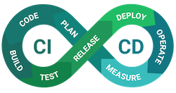

# CI⚡CD: the theory put into practice
GitLab: 

  
GitHub:

> This is a sample repository to show a possible configuration of a GitLab pipeline and deploy with Ansible for a software written in php with Symfony framework.

Inside the [.gitlab-ci.yml](./.gitlab-ci.yml) file you will be able to see the configuration of the CI/CD.

At the following [link](https://gitlab.com/JellyBellyDev/ci-cd-theory-into-practice/-/pipelines/254919519) you can see an example of a GitLab pipeline.

[Here](https://vimeo.com/537494819) the video of the speach at the phpday PUG Edition 2021.

This repository it's mirrored from [GitHub](https://github.com/JellyBellyDev/ci-cd-theory-into-practice) to [GitLab](https://gitlab.com/JellyBellyDev/ci-cd-theory-into-practice).
